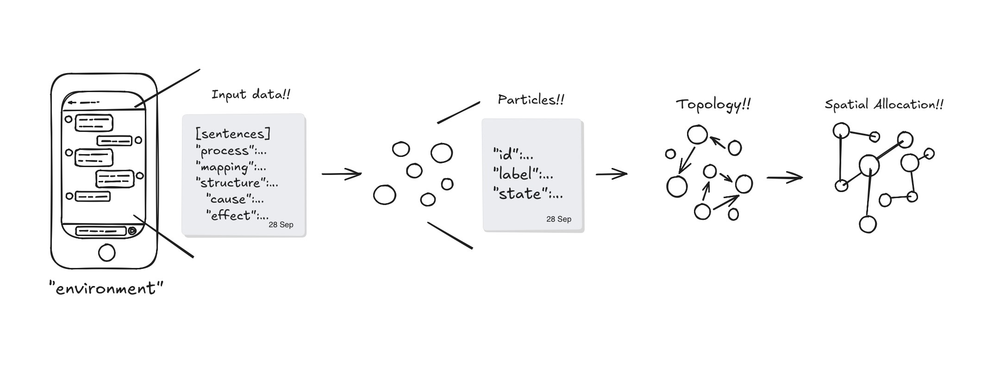

# Micro—ACT-R (tentative)
> "ACT-R at a Micro-Scale"
## What makes this different from standard ACT-R?

Standard ACT-R operates on a macro level with production rules. This project zooms into the micro-level of cognitive processing.

## Overview
**Micro–ACT-R operates through a clear, fully explainable pipeline from input to reasoning and execution:**

First, text is acquired from the **Environment** and parsed in the **Input** stage into individual cognitive **particles** (Particle Encapsulation).

Next, during **Reasoning**, the system uses **Topological Mapping** to define relationships between particles and assigns explicit spatial coordinates via **Spatial Allocation**. These coordinates are logged directly into **Storage**.

The system then validates consistency between the category of knowledge and past experiences **(Match & Select)**, selects the appropriate action based on this consistency **(Execution)**, and finally produces the **Output**.

## Micro-ACT-R Pipeline Architecture


1. [input-parser](https://github.com/ao-labs-123/input-parser)※Current Position
2. [particle-encapsulation](https://github.com/ao-labs-123/particle-encapsulation)
3. [topological-mapper](https://github.com/ao-labs-123/topological-mapper)

# Current Phase: Input Parsing


## The 5-Stage Logical Pipeline
**Our engine processes language through a bottom-up logical hierarchy:**

- [stage1:Agent and Subject Estimation](docs/en/stage1_design.md)
- [stage2:Context & Causality Inference](docs/en/stage2_design.md)
- [stage3:Modification Clarification](docs/en/stage3_design.md)
- [stage4:Argument Mapping](docs/en/stage4_design.md)
- [Stage 5: 5W1H Frame Extraction & Semantic Synthesis](docs/en/stage5_design.md)

# Verification with `log.json`

**The output and intermediate state of each stage are recorded deterministically in [`log.json`](data/log.json). This log serves as proof that the 5-stage inference operates through explainable logical compression without relying on heavy statistical predictions.**

## Example: Logical Inference vs. Probabilistic Guessing
Our engine avoids errors by using structural overrides instead of statistical weightings.

| Input | Logic Process | Result |
|--|--|--|
| **"Thought it was strange."** | **Psychological Verb + Null Subject** → [Default: Speaker] | AI correctly identifies `"I"`. |
| **"Please review the document."** | **Imperative/Direct Directive** → [Priority: Listener Address] | AI assigns `"You"` as the agent. |
| **"Thought it was strange, apparently."** | **Psychological Verb + Evidential Marker** → [Override: 3rd Party] | AI identifies the agent as a 3rd party. |
| **"Went to the cafe yesterday."** | **Null Subject + No Psychological/Evidential Markers** → [Fallback: Stage 2] | AI assigns `"Unknown"` and triggers clarification rule. |

In the second case, the "Evidential Marker" (⁠apparently⁠) acts as a logical trigger to override the default speaker-centric perspective. This deterministic logic ensures precision that probabilistic models often miss.

## Core Philosophy
By codifying the structural and cognitive rules of language into a lightweight engine, we achieve human-level contextual reasoning with a fraction of the memory and processing power.

## Key Pillars
1. **Explainability (Transparent Reasoning)**:

   Every inference step is driven by clear, rule-based logic. You can trace exactly why the AI interpreted a sentence a certain way.

2. **Language Agnostic Structure**:

   The logical core (Subject Inference, Semantic Categorization) is designed to be applicable across multiple languages, including Japanese and English.

## Quick Start

**1. Prerequisites**

- Python 3.10+

**2. Execution**

```
python src/main.py
```

**3. Output**

```json
 {
        "timestamp": "2026-10-07T09:43:36.737138",
        "input": "Thought it was strange apparently.",
        "stage1": {
            "process": "Null Subject + Evidential / Attribution Marker",
            "decision": "Override: Third Person",
            "agent": "He/She/They"
        },
        "stage2": {
            "process": "Event: State",
            "decision": "No causal relation; Event classified: State",
            "mapping": "He/She/They -> State -> strange apparently",
            "structure": {
                "relation": "Event",
                "event": {
                    "category": "State",
                    "verb": "strange",
                    "actor": "He/She/They",
                    "patient": "apparently",
                    "state": "strange"
                }
            },
            "agent": "He/She/They",
            "action": {
                "verb": "strange",
                "actor": "He/She/They",
                "patient": "apparently"
            }
        },
        "stage3": {
            "process": "Degree modifier",
            "decision": "Supplementary",
            "mapping": "Agent(He/She/They) -> Internal Eval -> State(Strange) -> How: Degree(Apparently)",
            "target": "strange",
            "modifier": "apparently",
            "attribution": {
                "target": "strange",
                "modifier_agent": "strange",
                "primary_agent": "He/She/They"
            },
            "structure": {
                "type": "Supplementary",
                "antecedent": "strange",
                "target": "strange",
                "clause": "apparently",
                "kind": "Degree",
                "classification": "Supplementary",
                "modifier_kind": "Degree"
            },
            "agent": "He/She/They"
        },
        "stage4": {
            "process": "[State predicate] → [Category: State]",
            "form": "State",
            "category": "State",
            "verb": null,
            "patient": "apparently",
            "actor": "Unspecified",
            "receiver": "Unspecified",
            "subject": "Thought it",
            "structure": {
                "form": "State",
                "state": "strange",
                "subject": "Thought it",
                "object": "apparently",
                "psychological_verb": "thought",
                "verb": null,
                "category": "State",
                "patient": "apparently",
                "agent": "He/She/They"
            }
        },
        "stage5": {
            "stage": "Stage 5 - 5W1H Synthesis",
            "frame": {
                "who": "He/She/They",
                "what": "thought it was strange",
                "when": "Unspecified",
                "where": "Unspecified",
                "why": "Unspecified",
                "how": "apparently"
            },
            "status": "Ready for Particle Encapsulation"
        }
    }
```

## Repository Structure

```repository

├── docs  
│    ├── stage1_design.md
│    ├── stage2_design.md
│    ├── stage3_design.md
│    ├── stage4_design.md
│    └── stage5_design.md  
│
├── data
│    ├── examples
│    │    └── all_examples.json
│    └── log.json
│
├── src
│    ├── lexicon
│    ├── rules
│    ├── analyzer.py
│    └── main.py
│  
├── README.md
└── LICENSE

```

